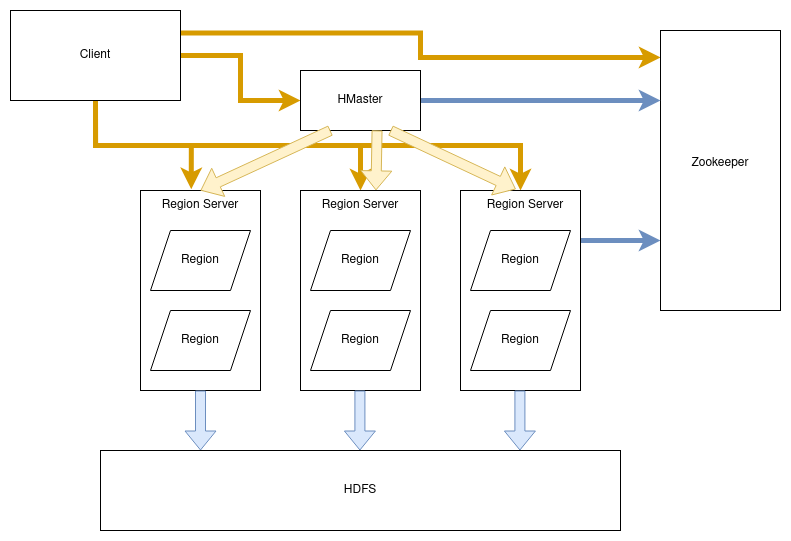

# NOTES

### NoSQL
1. Types: 
	1. Wide Column: Azure Cosmos DB, Cassandra, HBase
	2. Document: CouchDB, MongoDB
	3. Key-Value: Dynamo, Redis, Apache Ignite
	4. Graph: Azure Cosmos DB, AllegroGraph, Neo4j, Apache Giraph
2. SQL vs NoSQL
	1. relational vs distributed
	2. schema based and schemaless
	3. complex queries possible - complex is avoided
	4. not good for hierarchical data - good for hierarchical data
3. Why NoSQL?
	1. support for large number of concurrent users
	2. deliver highly responsive experiences to globally distributed base of users
	3. be always available -> no downtime
	4. handle semi and unstructured data
	5. rapidly adapt to changing requirements with frequent updates and new features
4. When to use NoSQL?
	1. Fast-paced AGILE development
	2. Storage of structured and semi-structured data
	3. Huge volumes of data
	4. requirements of scale-out architecture
	5. modern application paradigm like microservices and real-time processing
5. Misconcepts
	1. Relationship data is best suited for relational databases
	2. NoSQL databases don't support ACID transactions 	
6. RDBMS vs MongoDB
	1. db - db
	2. table - collection
	3. row - document
	4. columns - fields 
7. Example Document
	1. JSON(Java Script Object Notation) type file
8. Advantages
	1. Schema less
	2. no complex joins
	3. structure of single object is clear
	4. deep query-ability
	5. ease of scale out
	6. coversion/mapping of application objects to database objects is not needed
	7. uses internal memory(RAM) for storing the(windowed) working set, enabling faster access of data 
9. Why to use MongoDB?
	1. JSON
	2. index any attribute
	3. replication & high availability
	4. auto-sharding
	5. free
10. Where to use?
	1. Big data
	2. content management and delivery
	3. mobile and social infrastructure
	4. user data management
	5. data hub

### ETL
1. Links
	1. https://machinelearningcompass.com/dataset_optimization/standardization/
		
### HBase
1. Limitation of Hadoop
	1. Hadoop can perform only batch processing
	2. Sequential operations required
	3. Even for simplest job, entire dataset has to be searched
	4. A huge dataset when processed results in another huge data set, which should also be processed sequentially.
	5. At this point, a new solution is needed to access any point of data in a single unit of time(random access).
2. What is Hbase?
	1. distributed column-oriented non-relational database built on HDFS
	2. used for real time read/write access big data apps
	3. built for low latency 
3. Why Choose HBase?
	1. Most online analytics apps use HBase
	2. Traditional relational model limitations can be overcome
4. Features
	1. Low latency
	2. Large random read/write
	3. Linear & modular scaling over cluster environment
	4. Consistent read/write
	5. Automatic sharding
	6. Automatic failover support between Region Servers
	7. Convenient base classes for backing Hadoop MR jobs in HBase tables
	8. Easy to use Java API for client access
	9. Block cache and Bloom Filters for real-time queries - Cache used for frequently used records along with recently used record
	10. Query predicate pushes down via server-side filters
5. Importance of NoSQL in Hadoop
	1. Process, validation and storing
	2. NoSQL provices faster querying on huge datasets
	3. MongoDB and Cassandra 
6. How NoSQL is different?
	1. HBase stored data in key/value pairs. All column are grouped together as Column Families. Eg. Contact
	2. Flexible and low latency
7. HBase vs Hive
	1. Schemaless - Schema based
	2. no SQL - HQL
	3. Immediate - Eventual
	4. no secondary indexes - disabled in recent versions
	5. replication both 
8. Storage Mechanism in HBase
	1. Table is collection of rows
	2. Row is collection of column families 
	3. Column family is a collection of columns
	4. Column is collection of key-value pairs
	5. Each cell value of table has timestamp
9. Column vs Row 
	1. suitable for OLTP - OLAP
	2. small number - huge 
10. HBase vs RDBMS
	1. schema less - schema based
	2. semi structured - structured
11. Applications
	1. need to write heavy apps
	2. wherever large fast random acess required 

### HBase Architecture

1. Client connects to HMaster
2. HMaster connects to Region Server 
3. Region Servers contain different Region
4. Region Servers are on top of HDFS and communicate with Zookeeper

### HMaster

1. 