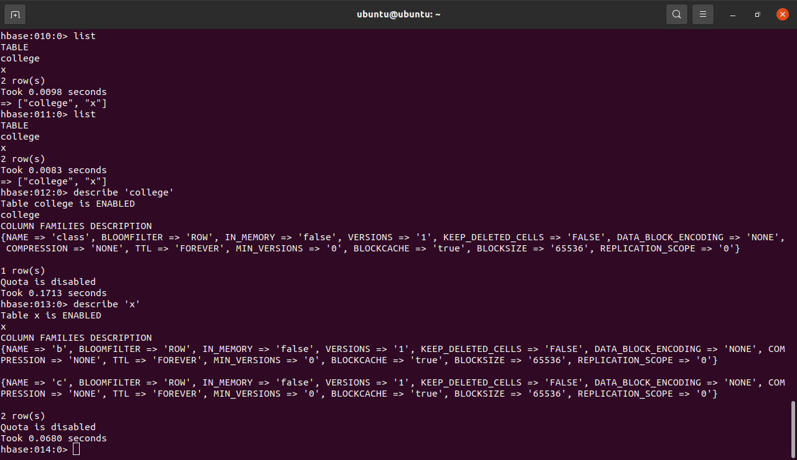
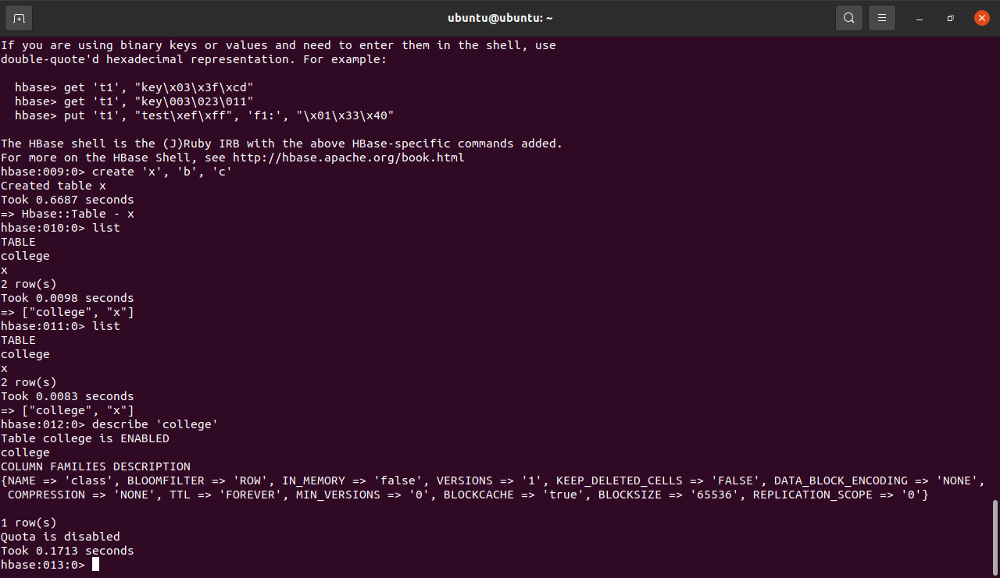
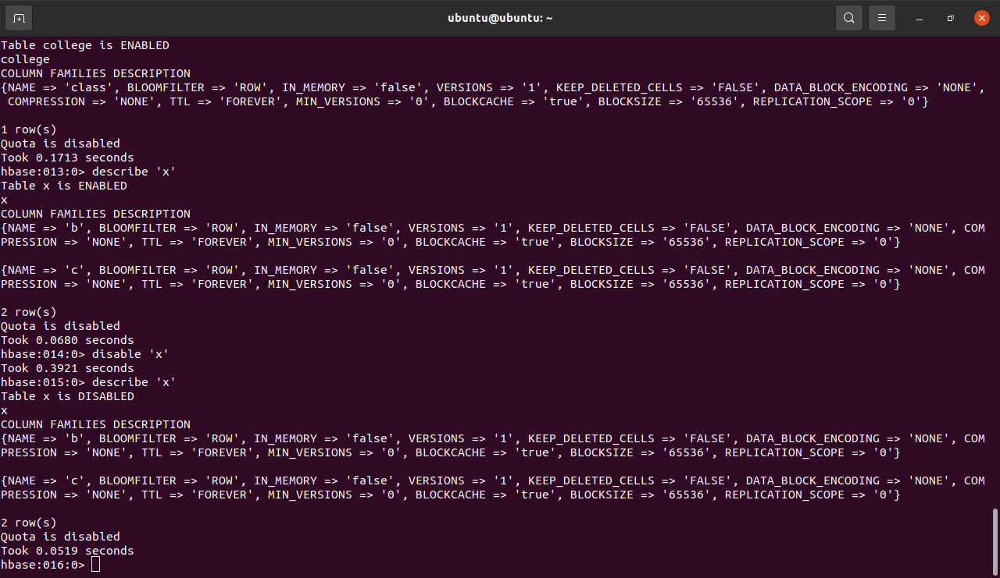
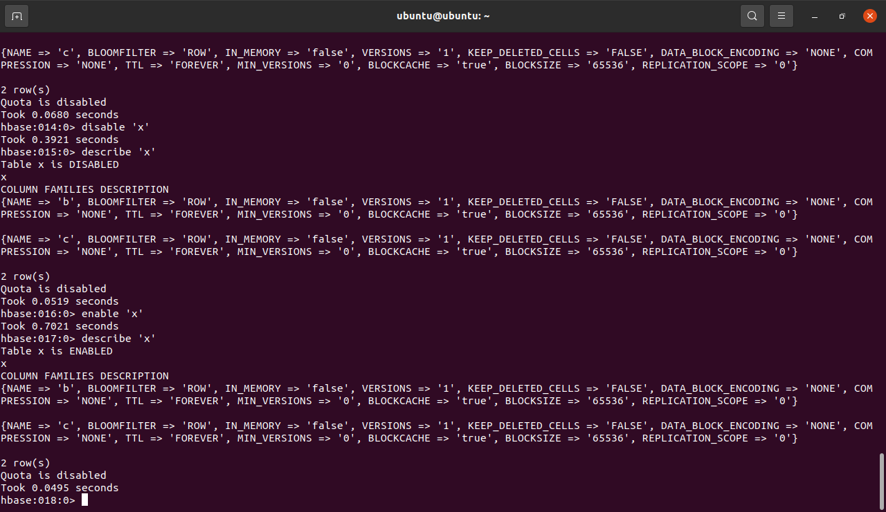
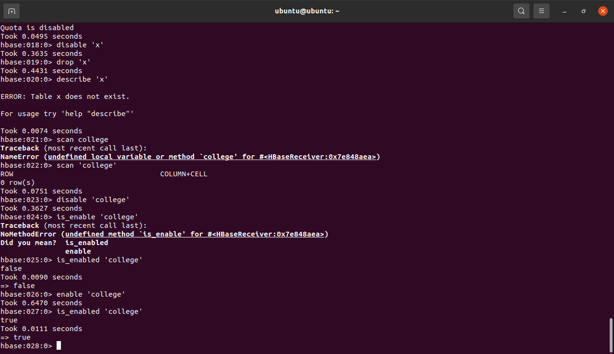
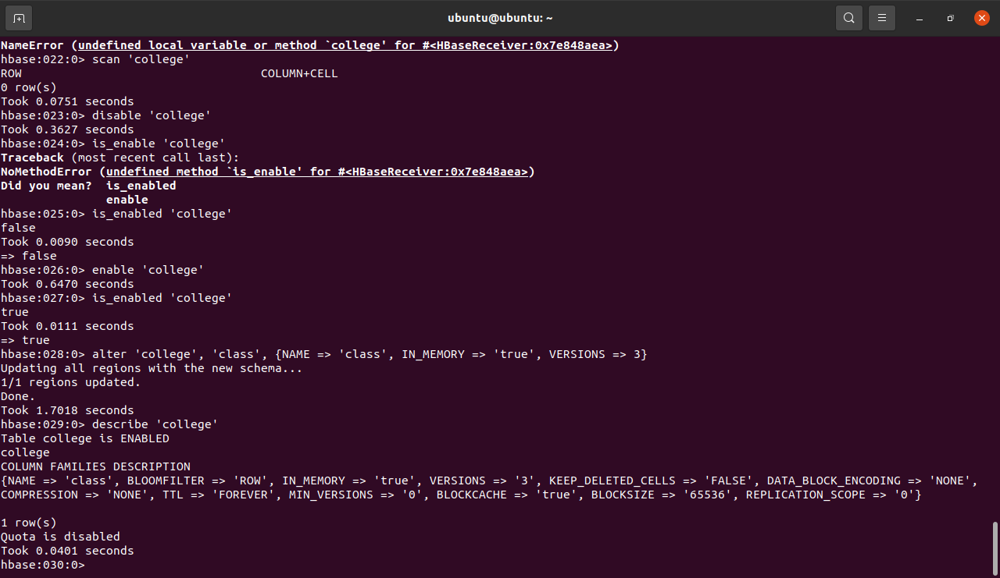

# NOTES:

1. HBase setup
	1. we can skip creating the hadoop/hfiles dir
	2. tmp is important but we missed that step
	3. stand alone is better for single node
	
2. HBase commands
	1. status    
	2. status 'detailed' 
	3. table_help
	4. create 'college', 'class' - we always add column family after table
	5. create 'x', 'b', 'c' - one table can have multiple cf
	6. list - displays all tables under hbase
	7. disable - if a table has to be deleted or dropped it has to be disabled first, it cannot be read once disabled
	8. enable - to reuse a table and enable reading 
	9. drop - to drop table
	10. is_enabled - to check if table is enabled, returns true/false
	11. alter - atlers column family schema, all items from describe
	12. c = get_table 'college'
	13. c.count
	14. put 'college','r1','class',100
	15. 
	
3. DML Commands
	1. count 
	2. scan - works like select * from SQL
	3. truncate - column family will be there but records will be deleted

4. Creating table and adding data with DML
	1. emp table
			```
			create 'emp','name','contact','address'
			
			put 'emp', '0101','name', "Ajay"
			put 'emp', '0101','contact:person',9898989865
			put 'emp', '0101','contact:office',7575758989
			put 'emp', '0101','address:temp','Abc'
			put 'emp', '0101','address:perm','Abc'
			
			put 'emp', '0102','name', "Sanjay"
			put 'emp', '0102','contact:person',9898989865
			put 'emp', '0102','contact:office',7575758989
			put 'emp', '0102','address:temp','Abc'
			put 'emp', '0102','address:perm','Abc'
			
			put 'emp', '0103','name', "Ria"
			put 'emp', '0103','contact:person',9898989865
			put 'emp', '0103','contact:office',7575758989
			put 'emp', '0103','address:temp','Abc'
			put 'emp', '0103','address:perm','Abc'
			
			
			put 'emp', '0104','name', "Simran"
			put 'emp', '0104','contact:person',9898989865
			put 'emp', '0104','contact:office',7575758989
			put 'emp', '0104','address:temp','Abc'
			put 'emp', '0104','address:perm','Abc'
			```  
	2. get names of all employees
			```
			scan 'emp',{COLUMNS=>['name'],LIMIT=>10,STARTROW=>'0101'}

			```
4. Links
	1. URL 1 - https://www.cloudduggu.com/hbase/data-model/
	2.  
5. Apache Airflow [link]
6. Images
	1.   describe x  
	2.   describe college
	3.   disable x  
	4.   enable x  
	5.   is_enabled college  
	6.   alter college describe  
	


