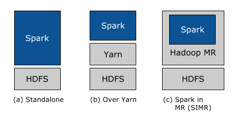
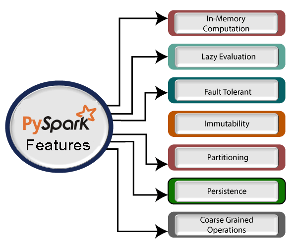

# NOTES

### Apache Spark

1. Spark Features
	
 

2. Spark on Hadoop

	 

3. PySpark Features
		
	 

4. Uses of Spark
	1. Data Integration:
	2. Stream Processing: 	
	3. Machine Learning:
	4. Interactive Analysis

5. Spark Practical
	* spark-shell
	* val rdd = sc.parallelize(Array(1,2,3,4,5))
	* rdd.getNumPartitions
	* rdd.collect()
	* spark.version
	* sc.appName
	* rdd.first()
	* val rdd = sc.parallelize(Array(1,2,3,4,5,8.7))
	* val rdd = sc.parallelize(Array(1,2,3,"lol",4,5,8.7))
	* val rdd = sc.textFile("fruits.txt")
	* val rdd = sc.wholeTextFiles("datasets/*")
	* rdd.foreach(f => { println(f) })
	* val rdd2 = rdd.map( f=> { f.split(",") })
	* rdd2.foreach(f => { println(f(0)+' '+f(1)+' '+f(2)) })
	* val rdd = spark.sparkContext.parallelize(Seq(("Java",20000),("Python",100000),("Scala",3000)))
	* import org.apache.spark.sql.SparkSession
	* val spark:SparkSession = SparkSession.builder().master("local[3]").appName("mitu.co.in").getOrCreate()
	* val rddString = spark.sparkContext.emptyRDD[String]
	* rdd.saveAsTextFile("test_rdd.txt")
	* val rdd = sc.parallelize(Array(1,2,3,4,5,6,7,8))
	* rdd.getNumPartitions
	* val rdd2 = rdd.flatMap( f => f.split(" "))
	* val rdd = sc.textFile("fruits.txt")
	* val rdd2 = rdd.flatMap( f => f.split(" "))
	* rdd2.collect()
	* import org.apache.spark.rdd.RDD
	* val rdd3:RDD[(String, Int)] = rdd2.map(m => (m,1))
	* val rdd4 = rdd3.filter( a => a._1.startsWith("M"))
	* val rdd5 = rdd3.reduceByKey(_+_)
	* rdd5.foreach(println)
	* val rdd = spark.sparkContext.parallelize( List("Germany India USA", "USA India Russia", "India Brazil Canada China"))
	* rdd.collect()
	* val wordsRdd = rdd.flatMap(_.split(" "))
	* val pairRDD = wordsRdd.map( f=> (f,1))
	* pairRDD.foreach(println)
	* val finalRDD = pairRDD.reduceByKey(_+_)
	* pairRDD.distinct().foreach(println)
	
6. Difference between RDD vs Dataframe vs Dataset
	
|            **Sr No, type**           	|                                    **RDD**                                   	|                        **DataFrames**                        	|                           DataSet                           	|
|:------------------------------------:	|:----------------------------------------------------------------------------:	|:------------------------------------------------------------:	|:-----------------------------------------------------------:	|
| 1, release                           	| 1.0                                                                          	| 1.3                                                          	| 1.6                                                         	|
| 2, representation                    	| distributed                                                                  	| columns                                                      	| type-safe, OOP friendly API                                 	|
| 3, data format                       	| structure/unstructured and schemaless                                        	| structured and semi-structured only                          	| both, collection of row objects so tabular and non tabular  	|
| 4, sources                           	| any source like text file or SQL                                             	| structured or semi-structured like csv, json, hive, mysql    	| multi source possible                                       	|
| 5, immutability and interoperability 	| immutable, can be converted to DF                                            	| once DF is formed, going reverse is not possible perfectly   	| Datasets allows conversion of existing RDD & DF to Datasets 	|
| 6, Compile-time type safety          	| yes                                                                          	| no, only at runtime(Python)                                  	| yes                                                         	|
| 7, optimization                      	| no in-built optimization, added externally                                   	| Catalyst optimizer,                                          	| internally uses DataFrame Catalyst optimizer                	|
| 8, garbage collection                	| yes, little overhead                                                         	| no                                                           	| no, data serialization uses heap                            	|
| 9, efficiency                        	| yes, due to serialization not the best                                       	| better, heap for serialization, dynamic byte code generation 	| best, no need to deserialize, on demand access              	|
| 10, serialization                    	|                                                                              	|                                                              	|                                                             	|
| 11, programming language support     	| Java, Scala, Python & R                                                      	| all                                                          	| Spark 2.1.1 doesn't support Python & R                      	|
| 12, Scheme projection                	| manually required                                                            	| auto restoring                                               	| auto restoring                                              	|
| 13, Aggregation                      	| slower                                                                       	| easy, EDA                                                    	| easy                                                        	|
| 14, Usage Area                       	| when you want low level transformation, when you need high level abstraction 	| if API available                                             	|                                                             	|

7. Spark DataFrame Practical
	* spark.createDataFrame([("Scala", 25000),("Spark", 35000),("PHP", 21000)]) 
	* sc.parallelize(data) works with any python datastructure like list, series, array, dictionary etc.
	* sc.textFile('/home/ubuntu/fruits.txt,/home/ubuntu/fruits1.txt')
	* sc.wholeTextFiles('/home/ubuntu/datasets/*')
	* rdd.getNumPartitions()
	* sometimes we want to repartition 
	* rdd2 = rdd.repartition(2)

### 2. Links

1. https://www.altexsoft.com/blog/hadoop-vs-spark/
2. https://www.oreilly.com/library/view/learning-spark-2nd/9781492050032/ch01.html
3. https://www.databricks.com/blog/2016/06/22/apache-spark-key-terms-explained.html
4. https://data-flair.training/blogs/apache-spark-sql/
5. Internal working of pyspark https://dev.to/steadbytes/python-spark-and-the-jvm-an-overview-of-the-pyspark-runtime-architecture-21gg
6. https://data-flair.training/blogs/apache-spark-rdd-features/
7. https://sparkbyexamples.com/spark/spark-save-a-file-without-a-folder-or-rename-part-file/
8. https://cloud.google.com/architecture/hadoop/validating-data-transfers
9. https://sparkbyexamples.com/spark/spark-flatmap-usage-with-example/
10. https://elc.github.io/posts/executable-flask-pyinstaller/
11. https://www.databricks.com/glossary/what-are-dataframes
12. https://pythonbasics.org/read-csv-with-pandas/
13. https://scikit-learn.org/stable/modules/classes.html#module-sklearn.datasets
14. https://www.baeldung.com/java-serialization